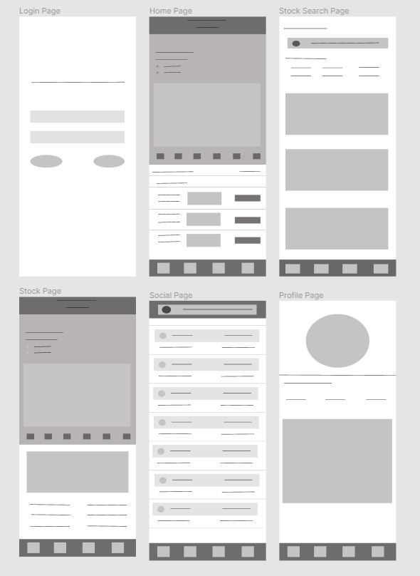
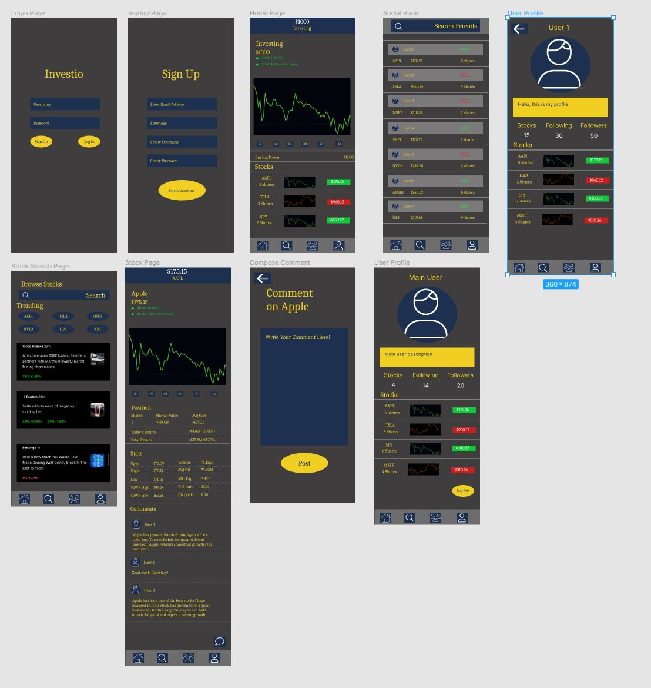

# Final GIF

**Original App Design Project
===

# Invest.io

## Table of Contents
1. [Overview](#Overview)
1. [Product Spec](#Product-Spec)
1. [Wireframes](#Wireframes)
2. [Schema](#Schema)

## Overview
### Description
[Invest.io is an application meant to educate people in trading on the stock market. It will allow users to buy and sell virtual stocks with fictional money. Using this app users will be able to see how well they can do on the stock market without the risk of losing money.]

### App Evaluation
[Evaluation of your app across the following attributes]
- **Category: Finances**
- **Mobile: This application is primarily meant for mobile devices but could be ported to personal computers. It would not lose any functionality if it were to be moved to a non-mobile version.**
- **Story: Allows the user to buy and sell stocks with virtual money on the stock market.**
- **Market: For ages thirteen and older who are interested in experimenting in the stock market.**
- **Habit: Invest.io can be used as often as the user pleases.**
- **Scope: First this will be used as an application to educate people in stocks, with long trading in mind. It could also be expanded to a social platform that allows users to compare their trades.**

## Product Spec

### 1. User Stories (Required and Optional)

**Required Must-have Stories**

* Have user be able to sign up and login/logout
* Show graphical data of stock prices
* Show historical data of stock prices
* Start users out at $1000 to invest and if the users reach a portofolio balance of $0 reset to $1000
* Have all major public companies on the app
* Include a social aspect where the user can follow other users
* In the social aspect the user can share and like fellow users purchases only if the user chooses to share
* Users can follow companies and add them to a watchlist/favorites
* Comment section for each stock to allow users to post/read their/others input about the stock
* Leaderboard
* light and dark mode

**Optional Nice-to-have Stories**
* Invites for rewards
* Show more up to date stock info
* Reward/level/leaderboard tier system for reaching higher portfolio thresholds
* Weekly/Monthly leaderboard showings. (Top earners for the previous day/week/month/year
* Show company background info(desription, employee count, ceo, location)
* Crypto

### 2. Screen Archetypes

* Login screen
  * login users
  * sign up button for new users
* Signup screen
  * users can sign up for the app
* Homepage
  * Users can see graphical data of their portfolio
  * Users can see historical data of their portfolio
  * Users can see Portfolio balance and their buying power
  * Usres can see current owned stocks
* Stock Search Page
  * Users can browse for any stock
  * Users can see trending stocks
  * Users can see news articles related to the stock market
* Stock Page
  * Users can see a detailed view of a particular stock
  * Users can see graphical and historical data for that particular stock
  * Users can see how much they have invested into that stock if they do at all
  * Users can see more details about the stock such as market cap and the highs and lows
  * Users can see comments other users have made about the stock
  * Users can post a comment about the stock
* Compose Comment Screen
  * Users can compose and comment and post it to the stock page
* Social Page
  * Users can see their friends recent activity
  * Users can see what their friends have bought and sold and the quantity of the stock 
  * User can click on a friends profile name or picture to see a detailed view of their profile
* Profile Pages
  * User can see profile picture
  * User can see user description
  * User can see how many stocks owned, following, and followers for that profile
  * Users can see a list of all the stocks owned with updated pricing

### 3. Navigation

**Tab Navigation** (Tab to Screen)

* Homepage tab
* Seach Stock tab
* Social Page tab
* User Profile tab

**Flow Navigation** (Screen to Screen)

* [list first screen here]
   * [list screen navigation here]
   * ...
* [list second screen here]
   * [list screen navigation here]
   * ...
* Homepage
  * Users can click on a stock to see the detailed view of that stock
  * Users can scrub through the graph to see dollar amount throughout history
* Stock Search
  * Users can click on any trending stock to see a detailed view of that stock
  * Users can type into the search bar to find any stock
  * Users can click on a news to story to be brought to the website of that story
* Stock Page
  * Users can scrub through the graph on a particular stock 
  * Users can click on the comment button to navigate to a screen to write out a comment and post it
* Social Page
  * Users can click on a another users profile picture or name to be brought to their profile page
  * Users can click on the stock that another user has interacted with to be brought to the detailed view of that stock
* User Profiles
  * Users can click on any of the stocks that a user owns to see a detailed view of that stock

## Wireframes

### [BONUS] Digital Wireframes & Mockups

### [BONUS] Interactive Prototype

## [Schema](https://github.com/Kushrati/investio-backend/blob/main/Documentation.md)

## Sprint 1 Demo

