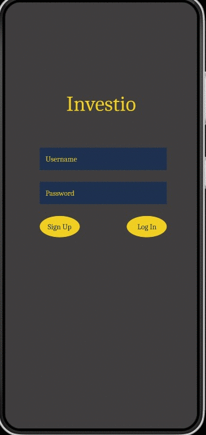
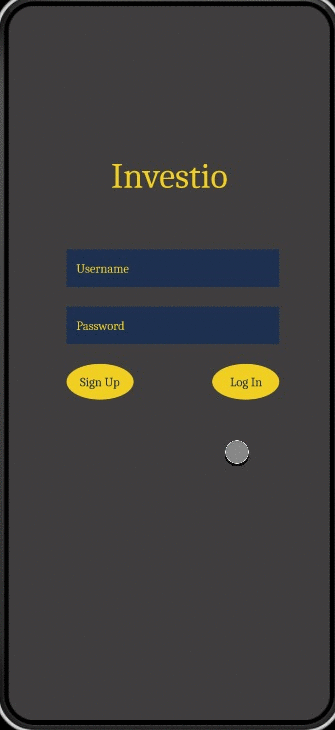

**Original App Design Project
===

# Invest.io

## Table of Contents
1. [Overview](#Overview)
1. [Product Spec](#Product-Spec)
1. [Wireframes](#Wireframes)
2. [Schema](#Schema)

## Overview
### Description
[Invest.io is an application meant to educate people in trading on the stock market. It will allow users to buy and sell virtual stocks with fictional money. Using this app users will be able to see how well they can do on the stock market without the risk of losing money.]

### App Evaluation
[Evaluation of your app across the following attributes]
- **Category: Finances**
- **Mobile: This application is primarily meant for mobile devices but could be ported to personal computers. It would not lose any functionality if it were to be moved to a non-mobile version.**
- **Story: Allows the user to buy and sell stocks with virtual money on the stock market.**
- **Market: For ages thirteen and older who are interested in experimenting in the stock market.**
- **Habit: Invest.io can be used as often as the user pleases.**
- **Scope: First this will be used as an application to educate people in stocks, with long trading in mind. It could also be expanded to a social platform that allows users to compare their trades.**

## Product Spec

### 1. User Stories (Required and Optional)

**Required Must-have Stories**

* Have user be able to sign up and login/logout
* Show graphical data of stock prices
* Show historical data of stock prices
* Start users out at $1000 to invest and if the users reach a portofolio balance of $0 reset to $1000
* Have all major public companies on the app
* Include a social aspect where the user can follow other users
* In the social aspect the user can share and like fellow users purchases only if the user chooses to share
* Users can follow companies and add them to a watchlist/favorites
* Comment section for each stock to allow users to post/read their/others input about the stock
* Leaderboard
* light and dark mode

**Optional Nice-to-have Stories**
* Invites for rewards
* Show more up to date stock info
* Reward/level/leaderboard tier system for reaching higher portfolio thresholds
* Weekly/Monthly leaderboard showings. (Top earners for the previous day/week/month/year
* Show company background info(desription, employee count, ceo, location)
* Crypto

### 2. Screen Archetypes

* [list first screen here]
   * [list associated required story here]
   * ...
* [list second screen here]
   * [list associated required story here]
   * ...

### 3. Navigation

**Tab Navigation** (Tab to Screen)

* [fill out your first tab]
* [fill out your second tab]
* [fill out your third tab]

**Flow Navigation** (Screen to Screen)

* [list first screen here]
   * [list screen navigation here]
   * ...
* [list second screen here]
   * [list screen navigation here]
   * ...

## Wireframes
[Add picture of your hand sketched wireframes in this section]
https://www.figma.com/file/PU6is3q70oT7IpxAa86O1s/LoFi?node-id=0%3A1

### [BONUS] Digital Wireframes & Mockups
https://www.figma.com/file/2AmHGKzvSSIGIS4AnMZWL3/HiFi?node-id=0%3A1

### [BONUS] Interactive Prototype

## Schema 
[This section will be completed in Unit 9]
### Models
[Add table of models]
### Networking
- [Add list of network requests by screen ]
- [Create basic snippets for each Parse network request]
- [OPTIONAL: List endpoints if using existing API such as Yelp]
